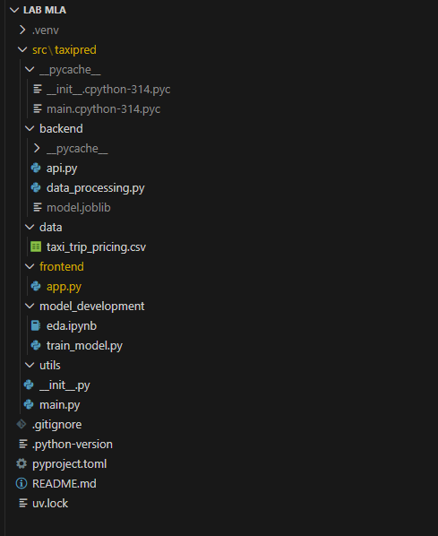
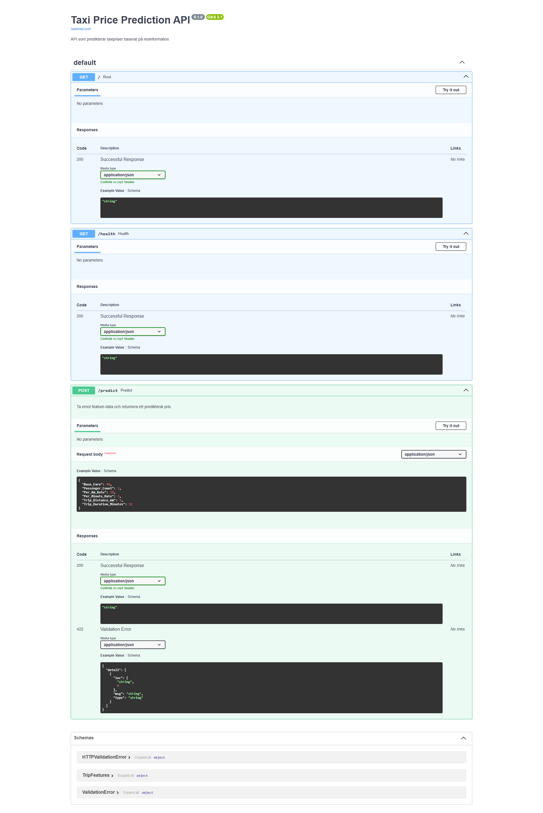
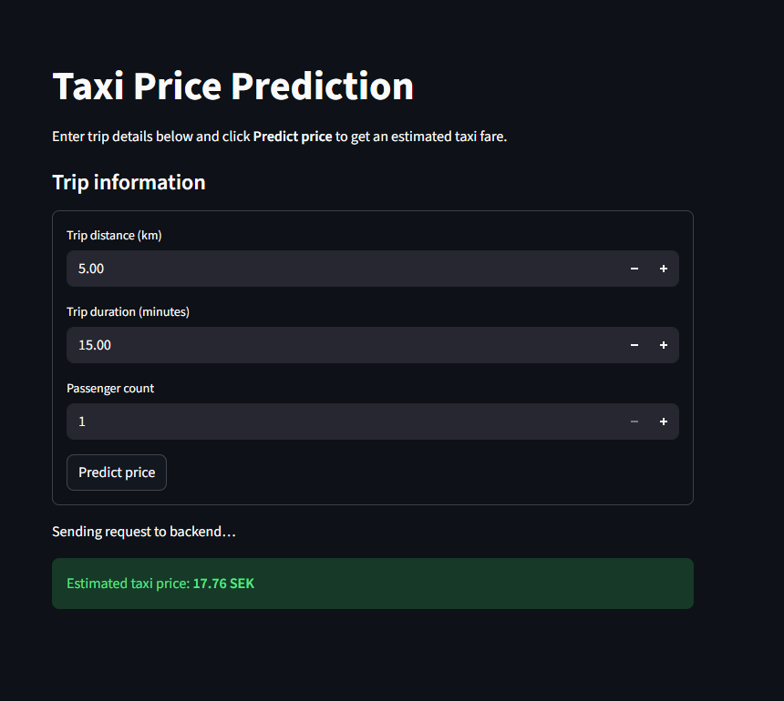

# Taxi Price Prediction - Fullstack Machine Learning Application

This project is a fullstack ML application built as part of the Nackademin _Machine Learning & Algorithms / MLOps_ course.  
The goal is to train a machine learning model that predicts taxi trip prices and deploy it through:

- a **FastAPI backend**
- a **Streamlit frontend**
- packaged and runnable via **uv**

## Project Overview

The application contains:

- **Data processing pipeline**
- **Model training code**
- **A trained RandomForest model**
- **FastAPI backend with prediction endpoint**
- **Streamlit UI for users**
- **Complete project packaging using uv / pyproject.toml**

## Project Structure

Below is the structure of the final application:

### Project Structure Screenshot



## Data & Model Development

The raw dataset (`taxi_trip_pricing.csv`) contains trip information such as distance, duration, base fare and rate configurations.

### **Target Feature**

- `Trip_Price`

### **Features used for training**

- `Trip_Distance_km`
- `Trip_Duration_Minutes`
- `Passenger_Count`
- `Base_Fare`
- `Per_Km_Rate`
- `Per_Minute_Rate`

A `RandomForestRegressor` was trained using:

```bash
uv run src/taxipred/model_development/train_model.py
```

The traind model is saved to:

```text
src/taxipred/backend/model.joblib
```

## Backend - FastAPI

The backend provides two main endpoints:

### GET /health

Health check.

### POST /predict

Returns a predicted taxi price in SEK given trip data.

Start the backend using:

```bash
uv run taxipred
```



## Frontend - Streamlit

A simple UI built with Streamlit allows users to input:

- Trip distance (km)
- Trip duration (minutes)
- Passenger count

Additional parameters (Base_Fare, Per_Km_Rate, Per_Minute_Rate) are defined automatically in the frontend for smoother UX.

Run the frontend:

```bash
uv run streamlit run src/taxipred/frontend/app.py
```



## How to Run the Entire Application

Run backend and frontend in separate terminals.

### Terminal 1 - Backend

```bash
uv run taxipred
```

### Terminal 2 - Frontend

```bash
uv run streamlit run src/taxipred/frontend/app.py
```

### The app will now be available at:

```arduino
http://localhost:8501
```
